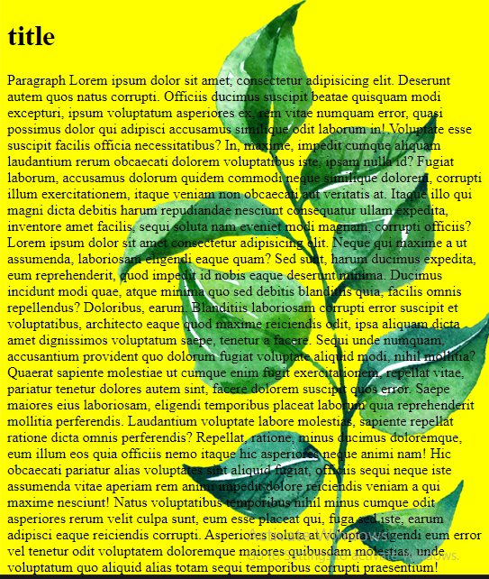

# Bg Images, Attachments, Repeats, Position

```
 body{
    background-image: url("https://media.istockphoto.com/id/1146517111/photo/taj-mahal-mausoleum-in-agra.jpg?s=612x612&w=0&k=20&c=vcIjhwUrNyjoKbGbAQ5sOcEzDUgOfCsm9ySmJ8gNeRk=");

    background-repeat: no-repeat;

    /*background-repeat: repeat-x; => repeats horizontally*/

    /*background-repeat: repeat-y; => repeats horizontally*/

    background-position: right top;

    background-attachment: fixed;/* The image won't scroll*/
}

<!-- Short Hand -->
background: yellow url("leaf.png") right top no-repeat fixed;
            
```

